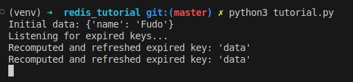

# redis_tutorial

## Start virtual environment

`sudo pip3 install virtualenv`

`python3 -m venv venv`

`source venv/bin/activate`

## Run

`pip install redis`

`docker run --name redis-server -p 6379:6379 -d redis`

`python3 tutorial.py`

## Probalilistic early expiration 2nd version

Assign randomly `TTL (Time To Live)` for the key depends on the `compute time` of the function. 
Min TTL is 10 seconds.

The formula to probalilistic is noted detail in `calculate_probabilistic_ttl()` function.

The 2nd version is better than the 1st version since it calculate the expired time based on the `compute time` of the function and assign the TTL depends on it.

Result:

As you see, after 10 seconds, some of the keys are expired and re-assigned, but some of them aren't expired since they have longer TTL.