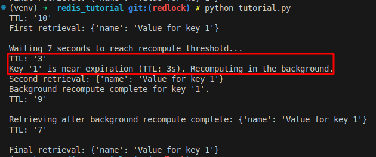

# redis_tutorial

## Start virtual environment

`sudo pip3 install virtualenv`

`python3 -m venv venv`

`source venv/bin/activate`

## Run

`pip install redis`

`docker run --name redis-server -p 6379:6379 -d redis`

`python3 tutorial.py`

## Exeternal computation - early recomputation

Set the early predict expire time, if that time meet, we will run the process in the background (using python Thread) to calculate and re-assign the key.

Result:

As you see, when the predict expire time (less than or equal to <b>3 seconds</b>) is met, we run a background process to calculate and re-assign the key.