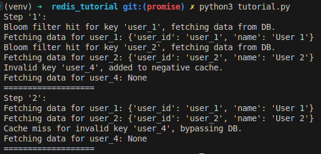

# redis_tutorial

Start virtual environment

`sudo pip3 install virtualenv`

`python3 -m venv venv`

`source venv/bin/activate`

Run

`pip install redis celery`

`docker run --name redis-server -p 6379:6379 -d redis`

`python3 tutorial.py`

`celery -A tasks worker --loglevel=info`

## Exeternal computation - early recomputation

Use `redis event` as a `pubsub` to check if the key is expired, if it does, then automatic re-assign. 
The 2nd version using `celery` as `worker` instead of using the main app as `worker`.

Result:

As you can see, the `worker` has found the key expired 2 times, and it automatic re-assined.